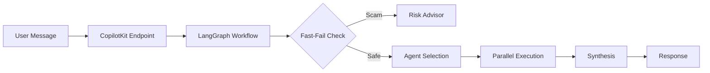

# FlagPilot Backend API Reference

## Overview

FlagPilot Backend v6.0 is a **LangGraph-based multi-agent system** for freelancer protection, integrated with CopilotKit for frontend connectivity.

**Base URL**: `http://localhost:8000`

---

## Endpoints

### Health & Status

#### `GET /`
Service information and available endpoints.

**Response**:
```json
{
  "name": "FlagPilot Agent API",
  "version": "6.0.0",
  "agents": 14,
  "architecture": "LangGraph + CopilotKit"
}
```

#### `GET /health`
Health check with feature list.

**Response**:
```json
{
  "status": "healthy",
  "version": "6.0.0",
  "agents": ["contract-guardian", "job-authenticator", ...],
  "features": ["LangGraph Team Orchestration", "RAGFlow Integration", ...]
}
```

---

### CopilotKit Integration

#### `POST /copilotkit`
Primary endpoint for CopilotKit AG-UI protocol.

**Request**: CopilotKit AG-UI message format
**Response**: Server-Sent Events (SSE) stream

This endpoint handles:
- Message extraction from CopilotKit
- LangGraph orchestrator invocation
- State emissions via `copilotkit_emit_state`
- Message streaming via `copilotkit_emit_message`

---

### Agent Metadata

#### `GET /api/agents`
List all available agents.

**Response**:
```json
{
  "agents": [
    {
      "id": "contract-guardian",
      "name": "Contract Guardian",
      "description": "Analyzes legal contracts for risks",
      "profile": "Senior Legal AI Analyst"
    },
    ...
  ],
  "count": 14,
  "framework": "LangGraph"
}
```

#### `GET /api/agents/{agent_id}`
Get details for a specific agent.

**Response**:
```json
{
  "id": "contract-guardian",
  "name": "Contract Guardian",
  "description": "Analyzes legal contracts for risks and unfair clauses",
  "profile": "Senior Legal AI Analyst",
  "goal": "Protect freelancers from unfair contracts"
}
```

---

### RAG Integration

#### `POST /api/v1/rag/ingest`
Ingest a document into the RAGFlow knowledge base.

**Request Body**:
```json
{
  "user_id": "user-123",
  "url": "https://example.com/document.pdf",
  "metadata": {"type": "contract"}
}
```

**Response**:
```json
{
  "success": true,
  "document_id": "doc-456"
}
```

---

### Debug

#### `GET /debug/agents`
Debug endpoint showing registered CopilotKit agents.

**Response**:
```json
{
  "agents": ["flagpilot_orchestrator"],
  "agent_types": ["LangGraphAgent"]
}
```

---

## Agent Capabilities

| Agent | Specialization |
|-------|----------------|
| contract-guardian | Legal contract analysis |
| job-authenticator | Scam detection, job verification |
| risk-advisor | Critical risk protocols (fast-fail) |
| scope-sentinel | Scope creep detection |
| payment-enforcer | Invoice collection |
| negotiation-assistant | Rate negotiation |
| communication-coach | Message drafting |
| dispute-mediator | Conflict resolution |
| ghosting-shield | Client recovery |
| profile-analyzer | Client vetting |
| talent-vet | Candidate evaluation |
| application-filter | Application screening |
| feedback-loop | Outcome learning |
| planner-role | Task planning |

---

## Orchestration Flow



---

## Error Responses

| Status | Description |
|--------|-------------|
| 404 | Agent or resource not found |
| 500 | Server error |

---

## Version History

- **v6.0.0** - LangGraph architecture
- **v5.x** - MetaGPT architecture (deprecated)
