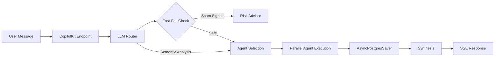

# FlagPilot Backend API Reference v6.1

## Overview

FlagPilot Backend v6.1 is a **LangGraph-based multi-agent system** for freelancer protection, integrated with CopilotKit for frontend connectivity.

**Base URL**: `http://localhost:8000`

---

## Endpoints

### Health & Status

#### `GET /`
Service information and available endpoints.

**Response**:
```json
{
  "name": "FlagPilot Agent API",
  "version": "6.1.0",
  "agents": 17,
  "architecture": "LangGraph + CopilotKit + PostgresCheckpointer"
}
```

#### `GET /health`
Health check with feature list.

**Response**:
```json
{
  "status": "healthy",
  "version": "6.1.0",
  "timestamp": "2024-12-28T12:00:00Z",
  "agents": ["contract-guardian", "job-authenticator", ...],
  "features": [
    "LangGraph Team Orchestration",
    "CopilotKit AG-UI Streaming",
    "AsyncPostgresSaver (State Persistence)",
    "LLM Router (Semantic Agent Selection)",
    "RAGFlow Integration",
    "Elasticsearch Memory",
    "LangSmith Observability"
  ]
}
```

---

### CopilotKit Integration

#### `POST /copilotkit`
Primary endpoint for CopilotKit AG-UI protocol.

**Request**: CopilotKit AG-UI message format
**Response**: Server-Sent Events (SSE) stream

This endpoint handles:
- Message extraction from CopilotKit
- LLM Router for semantic agent selection
- LangGraph orchestrator invocation with AsyncPostgresSaver
- State emissions via `copilotkit_emit_state`
- Message streaming via `copilotkit_emit_message`

---

### Agent Metadata

#### `GET /api/agents`
List all available agents (17 total).

**Response**:
```json
{
  "agents": [
    {
      "id": "contract-guardian",
      "name": "Contract Guardian",
      "description": "Analyzes legal contracts for risks",
      "profile": "Senior Legal AI Analyst",
      "credit_cost": 1
    },
    ...
  ],
  "count": 17,
  "framework": "LangGraph"
}
```

#### `GET /api/agents/{agent_id}`
Get details for a specific agent.

---

### Memory API (NEW in v6.1)

#### `GET /api/memory/wisdom`
Get global wisdom entries from Elasticsearch.

**Query Parameters**:
- `limit` (int): Max entries (default: 5)
- `category` (string): Filter by category

**Response**:
```json
{
  "wisdom": [
    {
      "insight": "Always request a deposit before starting work",
      "category": "contract",
      "confidence": 0.9,
      "tags": ["payment", "deposit"]
    }
  ]
}
```

#### `GET /api/memory/profile/{user_id}`
Get user profile from Elasticsearch.

#### `GET /api/memory/sessions/{user_id}`
Get recent chat sessions.

---

### RAG Integration

#### `POST /api/v1/rag/ingest`
Ingest a document into the RAGFlow knowledge base.

**Request Body**:
```json
{
  "user_id": "user-123",
  "url": "https://example.com/document.pdf",
  "metadata": {"type": "contract"}
}
```

**Response**:
```json
{
  "success": true,
  "document_id": "doc-456",
  "dataset_id": "ds-789"
}
```

---

## Agent Capabilities

| Agent | Specialization | Credit Cost |
|-------|----------------|-------------|
| contract-guardian | Legal contract analysis | 1 |
| job-authenticator | Scam detection, job verification | 1 |
| risk-advisor | Critical risk protocols (fast-fail) | 2 |
| scope-sentinel | Scope creep detection | 1 |
| payment-enforcer | Invoice collection | 1 |
| negotiation-assistant | Rate negotiation | 1 |
| communication-coach | Message drafting | 1 |
| dispute-mediator | Conflict resolution | 1 |
| ghosting-shield | Client recovery | 1 |
| profile-analyzer | Client vetting | 1 |
| talent-vet | Candidate evaluation | 1 |
| application-filter | Application screening | 1 |
| feedback-loop | Outcome learning | 0 |
| planner-role | Task planning | 1 |
| *+3 additional agents* | | |

---

## Orchestration Flow (v6.1)



---

## New in v6.1

### LLM Router (`agents/router.py`)
- Semantic task analysis using LLM
- Confidence scoring for agent selection
- Urgency detection (low/medium/high/critical)
- Fallback to keyword matching on LLM failure

### AsyncPostgresSaver
- Async-compatible checkpointer for streaming
- Tables: `checkpoints`, `checkpoint_blobs`, `checkpoint_writes`
- Uses `langgraph.checkpoint.postgres.aio`

### CopilotKit UI Actions
- `toggleMemoryPanel`: Open/close memory panel
- `showRiskAlert`: Display critical warnings
- `exportChatHistory`: Trigger chat export

---

## Error Responses

| Status | Description |
|--------|-------------|
| 404 | Agent or resource not found |
| 500 | Server error |

---

## Version History

- **v6.1.0** - Smart-Stack Edition (LLM Router, AsyncPostgresSaver, 17 agents)
- **v6.0.0** - LangGraph architecture
- **v5.x** - MetaGPT architecture (deprecated)
